---
, ma---
title: "Lab Notebook"
format: html
toc: true
editor: 
  markdown: 
    wrap: 72
---

# Date

## Goals

## Insights

## 

# Feb 05, 2026

Looking at the 16s and sylph data it seems like the general major taxa are all similar however some of the minor taxa are different. **Question:** How sensitive are each method of taxonomy, which do we trust? **Next Steps:**

- Split phyla into autotrophs and heterotrophs and mixotrophs

- Incorporate env metadata (O2 measurements as measure of respiration and carbon consumed?)

- Research into how I should go about sorting through this data

- Research into how the 16S data vs the metagenomic data works

- Keep working on getting binning data

- *Figure out if I need to normalize the data and how?*

```{r}
source("scripts/01_intro_script.R")
```

# Feb 06, 2026

Started looking at top 20 families. Code is in the bottom of "sylph_mircoeco". Also created spreadsheet with names of families and comments about what I could find out about their metabolism or ecology.

- Continue this work -

- Email Jay to get temp data

# Feb 10, 2026

**Questions:** Chitinophagaceae diversity at WM03. Is there a way to look into how confident we are about that? What is the metagenome data that I am seeing?

I am seeing a lot of variety within some of these families. I wonder if I should start to filter out some of the smaller taxa?

Setup a script to isolate families - at the end of sylph_microeco **Chitinophagaceae** - mostly just one genus and species though within the most common genus (sedimini..) there was a ton of diversity at WM03. Maybe points to errors in sequencing?

**Nitrosomonadaceae** - Lots of ammonia oxidizing to nitrate, nitrosomonas more abundant in the spring but nitrosospira abundant in the winter time. Is there functional redundancy here?

**Sphingomonadaceae** - More diversity in species within this family. There is not a ton of information exept some that might suggest they are aerobic and some strains were found in freshwater sediments and drinking water

Plotted abundances and saw a huge drop in abundance from WM16 to WM22 (April to June)

For next time: https://library.virginia.edu/data/articles/starting-non-metric-multidimensional-scaling-nmds

# Feb 16, 2026

- Imported matlab data to R. Used claude to get intial scripts to import the .mat file into python and then write to csvs. At the bottom of "Intro Scripts" there is a chunk to write all of those to a dataframe in R. Matlab date is since jan 1, 1900 rather than jan 1, 1970.
- Decided to rewrite the matlab import in R, kept at the bottom of 01_intro_scripts. Updated `sw_meta$strat_season` based on first 40m of temperature. Summer = stratification, fall = post summer isothermal period, winter = reverse stratification, spring = post winter isothermal Found some cool plots that look different based on the temperature but both seem to show seasonal differences.

```{r}
source("scripts/01_intro_script.R") # if needed
tb2 <- trans_beta$new(mt_sylph, group = "strat_season", measure = "bray")
tb2$cal_ordination(method = "NMDS")
tb2$cal_ordination(method = "NMDS")
tb2$cal_manova(manova_all = TRUE)
print(tb2$res_manova)

tb2$plot_ordination(plot_color = "strat_season", plot_shape = "strat_season", plot_type = c("point", "ellipse")) +
  geom_arrow_chain(colour = "black") +
    ggtitle("Sylph NMDS")

  tb2 <- trans_beta$new(meco_16s, group = "strat_season", measure = "bray")
tb2$cal_ordination(method = "NMDS")
tb2$cal_ordination(method = "NMDS")
tb2$cal_manova(manova_all = TRUE)
print(tb2$res_manova)

tb2$plot_ordination(plot_color = "strat_season", plot_shape = "strat_season", plot_type = c("point", "ellipse")) +
  geom_arrow_chain(colour = "black") +
    ggtitle("16s NMDS") +
  NULL
```

# Feb 17, 2026

Added the 24 hour temperature centered on the sampling day. Ended up making the 14 day average. **TODO:** create a couple of figures to show cody the differences in 16s vs sylph data. Plot temperature on these axis, maybe look at PCoA? - Also trim the temperature data to have the same number of days averaged before the first station.

\# Feb 18, 2026 Created a couple of abundance plots to show differences between 16s data and sylph data. Moved a bunch of plots scirpts to the 02_plots script. Based on differences in how families change continue to keep writing down my findings. **Created a script to look at graphs of the most abundant families.**

**TODO** - How to deal with the difference between the mag data and the 16s data?

- Show NDMS graphs

- Show temperature determination

- Binning script?

- missing merged.fasta file

- Committee - Jay - Ted - Bill - Formal Thesis Proposal? - Job Stuff.

**First work on binning stuff, then lefse, then think about committee things.**

```{r}
  # Set rank (k, p, c, etc) and number of taxa to include
rank <- "o"
n <- 20

# Create abundance object
ts1 <- trans_abund$new(mt_sylph, taxrank = rank, ntaxa = n)

# Plot abunances
abund_s <- ts1$plot_bar(others_color = "grey70", xtext_keep = TRUE, legend_text_italic = FALSE, facet = "strat_season") +
  theme(axis.text.x = element_text(angle = 45, hjust = 1, vjust = 1, size=9)) +
  ggtitle("Sylph Data", subtitle = paste(n, "most abundant", rank))
abund_s

plotly_build(abund_s)

# Do the same but for 16s data
ts1 <- trans_abund$new(meco_16s, taxrank = rank, ntaxa = n)

# Plot abunances
abund_16 <- ts1$plot_bar(others_color = "grey70", xtext_keep = TRUE, legend_text_italic = FALSE, facet = "strat_season") +
  theme(axis.text.x = element_text(angle = 45, hjust = 1, vjust = 1, size=9)) +
  ggtitle("16s Data", subtitle = paste(n, "most abundant", rank))
abund_16
```

# Plot just a single taxa abundance

```{r}
# Clone dataset
taxa <- "Chitinophagaceae" # taxa of interest
n <- 20 # Number of taxa to included in final graph
mt_sylph_subset <- clone(mt_sylph)

###mt_sylph_subset include the taxa below
mt_sylph_subset$tax_table <- mt_sylph_subset$tax_table |> 
  filter(f == taxa)
mt_sylph_subset$tidy_dataset()

# check
mt_sylph_subset # OK
head(mt_sylph_subset$tax_table)

# recalculate abundances (needed?)
mt_sylph_subset$cal_abund()
mt_sylph_subset$taxa_abund

# plot:

t1 <- trans_abund$new(dataset = mt_sylph_subset, taxrank = "g", ntaxa = n)
t1$plot_bar(facet = "strat_season") +
  ggtitle(taxa)

# Clone dataset
taxa <- "Nitrosomonadaceae" # taxa of interest
n <- 20 # Number of taxa to included in final graph
mt_sylph_subset <- clone(mt_sylph)

###mt_sylph_subset include the taxa below
mt_sylph_subset$tax_table <- mt_sylph_subset$tax_table |> 
  filter(f == taxa)
mt_sylph_subset$tidy_dataset()

# check
mt_sylph_subset # OK
head(mt_sylph_subset$tax_table)

# recalculate abundances (needed?)
mt_sylph_subset$cal_abund()
mt_sylph_subset$taxa_abund

# plot:

t1 <- trans_abund$new(dataset = mt_sylph_subset, taxrank = "g", ntaxa = n)
t1$plot_bar(facet = "strat_season") +
  ggtitle(taxa)


# Clone dataset
taxa <- "Sphingomonadaceae" # taxa of interest
n <- 20 # Number of taxa to included in final graph
mt_sylph_subset <- clone(mt_sylph)

###mt_sylph_subset include the taxa below
mt_sylph_subset$tax_table <- mt_sylph_subset$tax_table |> 
  filter(f == taxa)
mt_sylph_subset$tidy_dataset()

# check
mt_sylph_subset # OK
head(mt_sylph_subset$tax_table)

# recalculate abundances (needed?)
mt_sylph_subset$cal_abund()
mt_sylph_subset$taxa_abund

# plot:

t1 <- trans_abund$new(dataset = mt_sylph_subset, taxrank = "g", ntaxa = n)
t1$plot_bar(facet = "strat_season") +
  ggtitle(taxa)


# Nested plot
# t1 <- trans_abund$new(dataset = mt_sylph_subset, taxrank = "s", ntaxa = n, show = 0, high_level = "g", high_level_fix_nsub = 10)
# t1$plot_bar(ggnested = T) |> plotly::ggplotly()
```

# Temp Plots

```{r}
#import temp file
mat_df <- readMat.default(con = "data/metadata/LSEO24h_temp.mat")

# Extract dataframe we want from 'T' for temp and convert matlab time to poxit time
temp_df <- mat_df$T |> 
  as.data.frame()
# Set colnames and rownames
colnames(temp_df) <- mat_df$dep  
rownames(temp_df) <- mat_df$t 
# move dttm column out, convert to datetime and pivot long
temp_df_long <- temp_df |> 
  rownames_to_column(var = "dttm") |>
  mutate(dttm = as_datetime((as.numeric(dttm) - 719529) * 86400)) |> 
  pivot_longer(cols = !dttm, names_to = "depth", values_to = "temp") |> 
# Add averaged temperature column
  mutate(date = round_date(dttm, unit = "day"), 
  depth = as.numeric(depth)) |> 
  group_by(date, depth) |> 
  mutate(temp_c_24h_avg = mean(temp)) |> 
  ungroup()

## Create a 14 day averaged temperature---------------------------------
locs <- seaprocess::find_near(vec = as_date(temp_df_long$date), vals = as_date(sw_meta$date))
dates <- as_date(rep(NA, nrow(temp_df_long)))
for(i in length(locs):1) {
dates[1:locs[i]] <- as_date(sw_meta$date[i])
}
rm(i)
# Add the 14ish day average
temp_df_long<-temp_df_long |>
  mutate(sample_date = dates) |> 
  group_by(sample_date, depth) |> 
  mutate(temp_c_14d_avg = mean(temp)) |> 
  ungroup()

temp_plot <- temp_df_long |> 
  mutate(depth = as.numeric(depth), color = depth) |> 
  filter(depth < 50) |> 
  ggplot(aes(dttm, temp_c_24h_avg)) +
    geom_vline(xintercept = sw_meta$date) +
    geom_vline(xintercept = sw_meta$date[which(sw_meta$sample == sw_meta$sample[6:10])], color = "red") +
    geom_point() +
    scale_color_grey() +
    geom_point(data = temp_df_long[temp_df_long$depth == 38,], color = "red") +
    theme(legend.position = "none") + 
    theme_classic()

temp_plot


```

# Diversity Plot

```{r}
mt_sylph$alpha_diversity |>
  rownames_to_column("sample") |> 
  ggplot(aes(sample, Simpson, group = 1)) +
  geom_point() +
  geom_line() +
  ggtitle("Sylph")


meco_16s$alpha_diversity |>
  rownames_to_column("sample") |> 
  ggplot(aes(sample, Simpson, group = 1)) +
  geom_point() +
  geom_line() + 
  ggtitle("16s")

```

# Interpretation

See a big drop in diversity at WM19 in both 16s and sylph, both are less consistent in the initial months. WM19 is at the end of April beginning of May when the water column is weakly stratified.

# Feb 19, 2026

Looking at MAG families:

## **Microbacteraceae:**

Decreases summer into fall, increases winter into spring. All the same genus *Rhodoglobus* within actinobacteria. Species of *Rhodoglobus* change from summer into spring. Some other speices cultured from an antarctic lake and able to work at 5degC.

### Rhodoglobus Plot

```{r}
# Clone dataset
taxa <- "Rhodoglobus" # taxa of interest
n <- 5 # Number of taxa to included in final graph
mt_sylph_subset <- clone(mt_sylph)

###mt_sylph_subset include the taxa below
mt_sylph_subset$tax_table <- mt_sylph_subset$tax_table |> 
  filter(g == taxa)
mt_sylph_subset$tidy_dataset()

# check
mt_sylph_subset # OK
head(mt_sylph_subset$tax_table)

# recalculate abundances (needed?)
mt_sylph_subset$cal_abund()
mt_sylph_subset$taxa_abund

# plot:

t1 <- trans_abund$new(dataset = mt_sylph_subset, taxrank = "s", ntaxa = n)
t1$plot_bar(facet = "strat_season") +
  ggtitle(taxa)
```

### Microbacteraceae Plot


## UBA 1268

#### Trends

Drops a lot going into the winter time, doesn't return coming into spring time. QWPN01 dominates at first but then BAIKAL-G1-2R takes over.

```{r}
# Clone dataset
taxa <- "Pirellulales" # taxa of interest
n <- 5 # Number of taxa to included in final graph
mt_sylph_subset <- clone(mt_sylph)

###mt_sylph_subset include the taxa below
mt_sylph_subset$tax_table <- mt_sylph_subset$tax_table |> 
  filter(o == taxa)
mt_sylph_subset$tidy_dataset()

# check
mt_sylph_subset # OK
head(mt_sylph_subset$tax_table)

# recalculate abundances (needed?)
mt_sylph_subset$cal_abund()
mt_sylph_subset$taxa_abund

# plot:

t1 <- trans_abund$new(dataset = mt_sylph_subset, taxrank = "g", ntaxa = n)
t1$plot_bar(facet = "strat_season") +
  ggtitle(taxa)
```

Scratch that. Talked with Cody today and he said we should be looking at the 16s data as it has a less sensitive cutoff so may be more "accurate" than the sylph data. Updated binning script by checking each part individually, removed the 'environment' option fom the multi binning part, and changed the delimiter in the final contigs file to look for '\_' instead of ':'. Once each one worked, I started the whole binning script and we will see how long it takes.

- Did some research into lefSE and using that in microeco. The resulting code is at the bottom of 16s analysis. The next thing to do is to look at what taxa are coming out there.
- See if I can get some other data from Jay. - CHECK
- Start laying out some figures (read a couple of papers)
- Email Stormi about outside thesis committee folks - CHECK

# March 6, 2026

Loaded maestro data into R. There is bad data at the beginning of the deployment for the first two days. Then some of the sensors crap out at the end (pCO2). **TODO:** - Figure out how to best deal with outliers in the variables - Average data and add to metadata - Ask Cody about how to best average the environmental data - Reorganize scripts to output the .csvs and load in the rest from excel files - CHECK - Use Bill's script to average the other data -CHECK

# March 17, 2026

Worked a lot today on the maestro data and tried to clean it up. Removed visually obvious outliers. made 24hr averages and added them to the meta data file. Decided on a 1degC temperature difference from the maestro to the closest thermistor to determine whether we could incorporate the maestro data into our analysis. Made my '01_metadata_import_clean.R' easy to just source or I can take the data products from my data folder.

**Outstanding questions:** - How to deal with outliers in oxygen data - Is a 1 degree change close enough for us to assume the water column is mixing? - pH and turbidity data

# March 19, 2026

**TODO:** Figure out differential abundance tests and why to use one over the other - Continue to calculate relative abundance **Notes:**Cody mentioned looking at the coefficient of variance to check whether things are diurnal or not. I wonder if it would make more sense to just take the average for everything so it is all the same? Maybe I'll go variable by variable.

# March 24, 2026

I got the mag data into a microtable, ran a LEfSe on it but nothing came up significant. I also looked at collinearity of the evironmental data . The JACTMZ01, sediminibacterium, and UBA10103 genuses were all the largest differences.

```{r}
# View sample table 

t1 <- trans_diff$new(dataset = mt_mag, method = "lefse", group = "strat_season", alpha = 0.1, taxa_level = 'g', lefse_subgroup = NULL)

t1$plot_diff_bar(threshold = 2)
# we show 30 taxa with the highest LDA (log10)
t1$plot_diff_bar(use_number = 1:30, width = 0.8)
```

```{r}
#NMDS for MAG data
tb2 <- trans_beta$new(mt_sylph, group = "strat_season", measure = "bray")
tb2$cal_ordination(method = "NMDS")
tb2$cal_manova(manova_all = TRUE)
print(tb2$res_manova)

tb2$plot_ordination(plot_color = "strat_season", plot_shape = "strat_season", plot_type = c("point", "ellipse"), NMDS_stress_text_prefix = "", ellipse_level = 0.95) +
  #   geom_text(
  #   data = tb2$dataset$otu_table, # Filter data for the label layer
  #   aes(label = sample),
  #   vjust = -1.1, # Adjust vertical position
  #   hjust = 0.5,  # Adjust horizontal position
  #   color = "black"
  # ) +
  # geom_arrow_chain(colour = "black") + 
    ggtitle("Sylph NMDS") +
  # scale_color_viridis_b() +
  NULL


  #PCA?
tb2 <- trans_beta$new(mt_sylph, group = "strat_season", measure = "bray")
tb2$cal_ordination(method = "PCA")
tb2$cal_manova(manova_all = TRUE)
print(tb2$res_manova)

tb2$plot_ordination(plot_color = "strat_season", plot_shape = "strat_season", plot_type = c("point", "ellipse"), loading_arrow = T, ellipse_level = 0.95) +
  #   geom_text(
  #   data = tb2$dataset$otu_table, # Filter data for the label layer
  #   aes(label = sample),
  #   vjust = -1.1, # Adjust vertical position
  #   hjust = 0.5,  # Adjust horizontal position
  #   color = "black"
  # ) +
  # geom_arrow_chain(colour = "black") + 
    ggtitle("Sylph NMDS") +
  # scale_color_viridis_b() +
  NULL

```

**TODO:** - Bug Cody about the metabolic data - Look more into how the taxa change - Plot PCA and update the NMDS to have the arrows - Figure out all the statistics I should be doing

# March 27, 2026

- Working through a book to figure out the stats https://uw.pressbooks.pub/appliedmultivariatestatistics/chapter/relativizations/
  - Currently trying to figure out which normalization to do on the abundance data. "Gower and X\^2 distances perform better than other measures in revealing the relationships among the samples along an environmental gradient even under low sequencing depth and the presence of noise in simulating abundance vectors The Jaccard dissimilarity measure was shown to perform well in revealing the cluster relationships when such relationships were prominent, but not very well for subtle clusters. The χ 2 distance was shown to perform well in revealing environmental gradients, but only moderately well in revealing underlying clusters." -
    - Statistical Analysis of micrbiome data (pg 84)

It's hard for me to tell from this which to use. This doesn't seem to be quite the right answer.

- As reccomended by the 'performance' package documentation, I called outliers based on MAD (median absolute deviation) instead of the mean in the environmental data.

# March 30, 2026

Continuing to work on stats and figuring out the right ones. Should look into **UniFrac** to see if that makes the most sense.

Chatting with Stormi about Joe as external committee member, need a CV and a a letter signed by Cody that says why we want him to be a committee member.

Compositional Samples: Samples that describe the relative composition of organisms in a sample. This ignore the total number of organisms counted. For example in WM01 we might have gotten 100 reads back that mapped to A B C and D equally. However in WM02 we only got a 10 reads back that mapped to A B C and D equally. These samples are counted as equals. However if we were out taking net samples. A sample with only 10 individuals would be different than our sample with 100 individuals. Because we cannot standardize the number of reads very well we think of microbial samples as compositional -- we care about their composition rather than absolute abundances. IE everything is already normalized to 0 to 1..

Also looked at a couple other books like Tuomas Borman, Leo Lahti, Sudarshan Shetty, Felix M Ernst, et al. 2026. Orchestrating Microbiome Analysis with Bioconductor \[Beta Version\]. microbiome.github.io/oma/. on github.

Based on information from: Borman et al., (2026), and Datta and Guha (2022 pdf), it seems like I should use a clr or rclr transformation and then Aitchison distances rather than Bray-Curtis. Did that to calculate Aitchison distances and then did a PCA based in information from...

```{r}
    tb2 <- trans_beta$new(mt_mag, group = "strat_season", measure = "aitchison")
tb2$cal_ordination(method = "PCA")
tb2$cal_manova(manova_all = TRUE)
print(tb2$res_manova)

tb2$plot_ordination(plot_color = "strat_season", plot_shape = "strat_season", plot_type = c("point", "ellipse"), ellipse_level = 0.95) +
  #   geom_text(
  #   data = tb2$dataset$otu_table, # Filter data for the label layer
  #   aes(label = sample),
  #   vjust = -1.1, # Adjust vertical position
  #   hjust = 0.5,  # Adjust horizontal position
  #   color = "black"
  # ) +
  # geom_arrow_chain(colour = "black") + 
    ggtitle("MAGs PCA") +
  # scale_color_viridis_b() +
  NULL
```

Right now have all the data sets with three dissimilarity tests: Bray, Aitchison, and robust Aitchison. All three show significance for the MANOVA but the plots look slightly different. The sylph/bray data has the nicest arrows pointing around. PCoA explain about 50% of the variation which is pretty cool.

Looks like the Diamond (2019) soil paper used weighted unifraq for distance measurements.

**TODO:** - Look at what variables explain most of the data - See if LefSE is the best option or not to look for interesting classes - Metabolic data from Cody - Import trees for unifrac stuff

# March 31, 2026

Meeting with Jay - Maestro Data Probably just trim off the last month of data, DO umol/L about 12 mg/L typically, check to see what reasonble values are, compare DO to thermocline. Take a look at whether high values are above the thermocline or not. Look at saturation.

Period tends to be about 17 hours, near-initial velocity. PCO2 looks diurnal starting in May. Convection from heating make surface water higher than 4c and sinks. Dan Sanborne - pCO2 paper - neural network based estimate of pC02 - ppm (uatm) CHLa seeing photobleaching in the diurnal signal.

Temperature Data 01 - Below thermocline, stable temp 02 - Below thermocline, stable temp 03 - Below thermocline, stable temp 04 - Below thermocline, stable temp 05 - Mostly below thermocline, couple big spikes after noon but noon temp would work 11 - isothermal, noon temp 12 - isothermal, noon temp 13 - isothermal, noon temp 14 - isothermal, noon temp 15 - isothermal, noon temp 16 - isothermal, noon temp 17 - isothermal, noon temp 18 - isothermal, noon temp 19 - isothermal, noon temp 20 - isothermal, noon temp 21 - isothermal, noon temp 22 - isothermal, noon temp 23 - isothermal, noon temp 24 - light thermocline, below thermocline stable temp

Based on temperature graphs it seems like I should just do the median value because there might be some variations in temperature especially in the March months when we have convective cooling and the community in those areas would be a reflection of that fluctuation in temperature.

Spent most of the day going through the environmental stuff. I feel pretty good about it so far. **Next Steps:** Finish looking at pH. Check out the end of the deployment and the periodicity of it. - Look at values from Minor to see what is normal - Look at oxygen values and how they fluctuate with temperature. I might need to get rid of some of the values before averaging them so I am only measuring below the thermocline

# April 2, 2026

Talked with Liz about pH data. Look at Minor et al 2019, Urban, Ask MTU person about carbon in the lake (who may be on the guardian?).

# April 6, 2026

Finished with most of the environmental data. Added a tree and unifrac distances into the MAGs data.

- Created a nice plot of the 16s data to show how the communities change. Used the robust aitchison with an NMDS

**TO DO:** - Output a nice looking table of significance for stratification season - Check and see if other things like not stratification season are different - Oooohhh maybe see if I can do a little overlapping of layers to show how the nmds is built?

# April 7, 2026 Made some nicer looking plots for my data

# April 8, 2026 Questions for Cody:

- how do I deal with tree data?
- metabolic stuff?
- any other way to define the groupings?

**ToDo:** - Make a nice PCoA figure with 16s data and environmental data - Look at the UBA taxa in the winter - Look at figures from other papers - Look at/do permanova - Group OTUs into phototrophs/autotrophs - Look at the figures on Cody's poster for how to list what number of genomes we extracted


Looked at temperature and saw that the temperature of the mooring actually rises throughout the year at specific points. Looking at an NMDS based on temperature, the temperature alone is not the predictor of grouping


# April 16, 2026

Finally finished running the metacerberus on all the assembled bins. Trying to interpret the outputs. KOFam - KEGG Ortholog (KO) database of genes that have identity and function. Basically just another database. The KEGG number is the identifier for the protein.

{width="635"}

# April 17, 2026

Created master tables of each core metagenome and genes so I can see what is conserved throughout the year. Saved under output/data. Started putting data into microeco to see if I can run LefSE on it, that didn't work, it's not in the right format. Next steps to see if I can get thinks in the right format to run lefse on my own.

Maybe look at all the MAGs too to see what is going on with them not just the core group

# April 19, 2026

Finished the Nature Comms paper on DA. Seems like ANCOM-II and ALDEx2 as the best options (though most conservative).

# April 20, 2026

Okay so I have abundances of genes in a bin AND abundances of bins in a sample. Can I assume that the genes in the bin correspond to that sample?

I found an issue showing that the genomes that coverM calculated abundances for across the samples AND the genomes that I have metabolic data for, are different. They are each about 200 genomes but only share 65 in common. Maybe I can see if I can pull the metabolic info from the genomes from the de_coverage info to see if I can figure out how the genomes change throughout the year.

I could also look at the taxonomy of both and see how they are different. This is something to ask cody.

Right now I have some code that just takes the genes taken from the genomes selected by coverM because there is an abundance associated with them.

# April 21, 2026

ANCOM-BC results: LFC is the log fold change - the change in abundance over season logged. I can add fixed and random effects. Probably should figure that out here soon.

Major groups to look at: Taxa - d\_\_Bacteria\|p\_\_Bacteroidota\|c\_\_Bacteroidia\|o\_\_Chitinophagales\|f\_\_Chitinophagaceae\|g\_\_Sediminibacterium\|s\_\_Sediminibacterium sp017996795\|WM15_S10_008 - d\_\_Bacteria\|p\_\_Patescibacteria\|c\_\_Paceibacteria\|o\_\_UBA9973\|f\_\_UBA2100\|g\_\_UBA10103\|s\_\_\|WM12_S7_040 - Taxa d\_\_Bacteria\|p\_\_Verrucomicrobiota\|c\_\_Verrucomicrobiae\|o\_\_Chthoniobacterales\|f\_\_JACTMZ01\|g**JACTMZ01\|s**\|WM03_S3_027 - d\_\_Bacteria\|p\_\_Actinomycetota\|c\_\_Actinomycetes\|o\_\_Nanopelagicales\|f\_\_Nanopelagicaceae\|g\_\_Planktophila\|s\_\_\|WM02_S2_051

d\_\_Bacteria\|p\_\_Pseudomonadota\|c\_\_Gammaproteobacteria\|o\_\_Burkholderiales\|f\_\_Burkholderiaceae\|g**Polaromonas\|s**\|WM22_S17_026

d\_\_Bacteria\|p\_\_Actinomycetota\|c\_\_Actinomycetes\|o\_\_Mycobacteriales\|f\_\_Mycobacteriaceae\|g**Mycobacterium\|s**\|WM02_S2_015

d\_\_Bacteria\|p\_\_Bacteroidota\|c\_\_Bacteroidia\|o\_\_Chitinophagales\|f\_\_Chitinophagaceae\|g**Sediminibacterium\|s**\|WM19_S14_012

d\_\_Bacteria\|p\_\_Actinomycetota\|c\_\_Actinomycetes\|o\_\_Mycobacteriales\|f\_\_Mycobacteriaceae\|g**Mycobacterium\|s**\|WM03_S3_040

d\_\_Bacteria\|p\_\_Planctomycetota\|c\_\_Planctomycetia\|o\_\_Planctomycetales\|f\_\_Planctomycetaceae\|g\_\_SXXK01\|s\_\_SXXK01 sp003670925\|WM04_S4_034

d\_\_Bacteria\|p\_\_Pseudomonadota\|c\_\_Gammaproteobacteria\|o\_\_Xanthomonadales\|f\_\_Xanthomonadaceae\|g**Arenimonas\|s**\|WM17_S12_035

\# April 22, 2026

Micropresentation feedback: - Look at "cliques" with igraph R package to look for similarly abundant taxa - There may be another R package out of Berkeley (IMG) for looking at guilds. - Paciefiobacteria have small genomes - Carbon - Urban measurments are close to shore - Look at the Sterner paper on carbon, ,and Liz's carbon measurements.\
- \[x\] Daily or 12 hour median temperatures/others for the environmental variables (this would be an easy change to make) (done April 23) - pH 'trend' is probably accurate but the values are not - Split the coloring up by stratification, or have each month as a color? - Add information on completeness of genomes and contamination - Possibly look at cyanos and what they are doing - Ask Emma about how to keep the colors the same across taxa - Mycobacteria, host associated - Also think about why CoverM removed the abundances for a bunch of genes?

Started working on fixing the data plots to have an average. So far it looks better code is under 05 - maestro plots

# April 23, 2026

Updated the sonde plot to be 24 hr averages. Look at cliques stuff next. Created a new little script to designate bins as high med low quality based on MIMAG criteria (thanks Maya!)

Rerunning coverM with a couple of different options: - using the --coupled tag for the reads and dereplicating - using the --coupled tag for the reads and not dereplicating to see what the abundances look like afterwards. This can run for a while because I still have all the gene information I need from metacerberus.

# April 24, 2026

So for some reason the mapping without dereplication didn't run but running the coupled abundance did run and instead put the relative abundances together it seems. I should try to compare the two to see if they are significantly different.

- Comparing the two abundances it seems like they are different. I'm not sure if it is significant at all but might be nice to check with Cody and see. It at least seems to be more accurate than just taking the forward reads to check the abundance. I'm going to go with the "coupled" group from here on out.

**FIX DOsat percent in metadata**

# May 8, 2026

Started back up! Just plotted the cliques over top of the temperature. I edited the axes so that the cliques look a little better on so they should be taken as quantitatitve not qualitiative.

# May 18, 2026

Tried to start looking at how gene abundances change over time but realized that I ran metacerberus on the the mags so the abundance data that I have is per mag not per sample. Rerunning it now on the servers looking for cazy and KOfam genes. I can then try the clique analysis. Also spent an annoying amount of time trying to figure out a lab calendar for the sheik lab and learning api stuff.

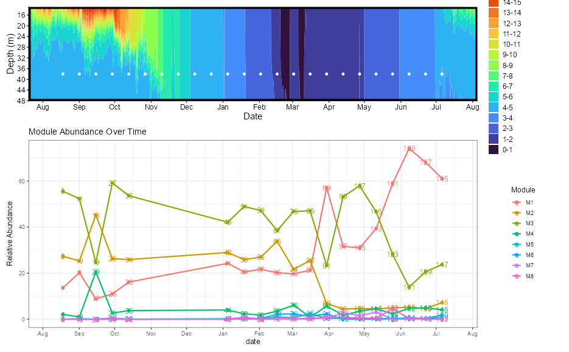

This graph needs a bit of work on the axes and such but otherwise looks pretty good.

Here's another graph:

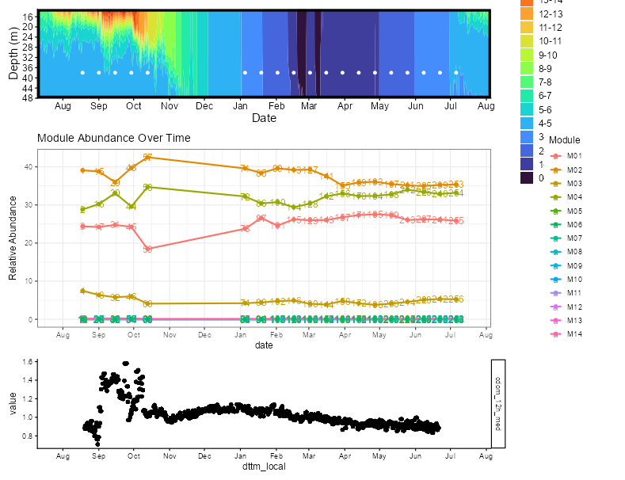

Re ran the cliques with a lower abundance threshold and got 5 cliques out of it. It looks like there are big shifts after mixing events that would affect that depth. In late Sept there was a mixing event where the thermocline dropped deeper and M2 and M4 popped off. Similar it see like the bigger changes happen after the water column warms and is mixed in May and June.

Biggest spikes in cliques are at: S3 S9 S12 S17

Looking at M1, it looks like the dominant genuses are: - Sediminibacterium (specifically OTU2 which dominates module 1 a lot) - Bateroidetes bacterium UKL 13-3 (OTU22) is a minor player - Bradyrhizobium is big during some of the mixing events particularly the one during the summer -- **what does this one do?** - Gemmata (OTU35) also a smaller player - f\_\_Comamonadaceae and an unknown genus (OTU13), seems to be one of the larger ones, this is a gammaproteobacteria

The one to look into would be Sediminibacterium and Bradyrhizobium and OTU13

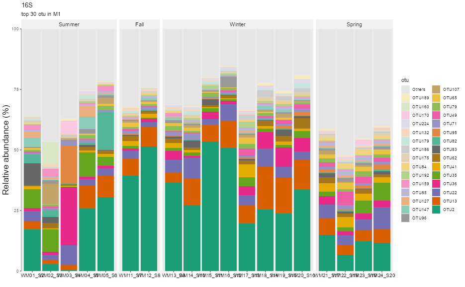

Looking at M2, dominant genuses are: - g\_\_Sediminibacterium (OTU19). THis one dominates in the late season, growing in the second half of winter and into spring - g\_\_LD29 (OTU6) which is a verrucamicrobial. This one is dominant during the summer but not during the rest of the year - g\_\_Phenylobacterium (OTU16) which is a bit all over the place but does spike during S12 and S17 which are post mixing events - g\_\_Leptothrix (OTU184) which shows un in the late winter and spring similar to sediminibacterium - g\_\_LD29 (OTU18) this one shows up in the summer and fall and is gone during the winter and spring. Follows the same pattern as the other OTU in it's genus - f\_\_Paracaedibacteraceae (OTU261). This has an unknown genus and species but shes up a lot in the late winter and spring - g\_\_IMCC26207 (OTU57) in f\_\_Microtrichaceae wich again, is more of a spring and late winter one

This module has a lot more variability than the others, it seems like there is a pretty start split between the first and second half of the year

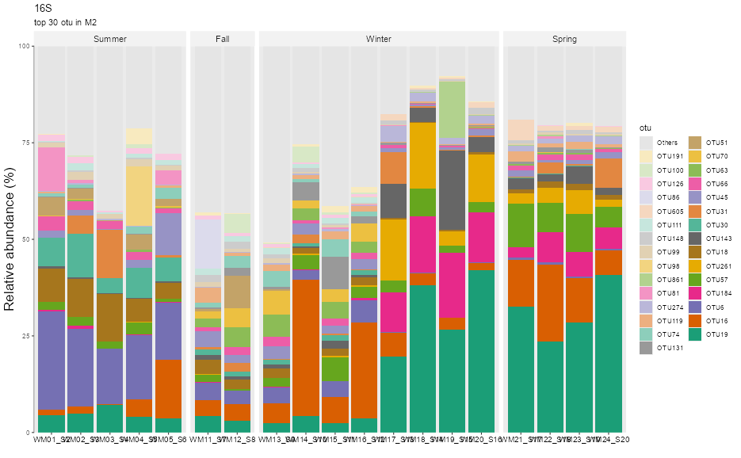

Looking at M3, dominant genuses are: On first glance, this one is a lot more variable without a couple of dominant genuses. However the most are: - g\_\_Novosphingobium (OTU1) which has kind of a wave pattern peaking in late fall and late winter but doesn't seem to be especially associated with seasonality - f\_\_Microbacteriaceae (OTU4), this one also has kind of a misxed bag but is much more around in spring and early summer. - f\_\_KD3-93 (OTU5), this one goes all over the place but is generally arround except for S3 - f\_\_Pirellulaceae (OTU12), this one is much more present during the summer but not so much once we get into fall. It is a planktomycete which tend to be particle associated we think

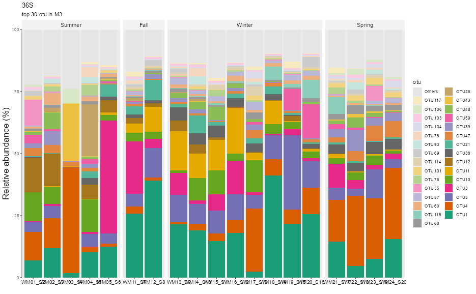

Lastly, M4 abundances: - g\_\_Prosthecobacter, s\_\_Cenchrus americanus(OTU29) which spikes late fall into winter - o\_\_Kapabacteriales the rest unknown (OTU28), this one is around a lot during the summer months and spring but not the fall and winter, maybe is a temperature thing for it. - g\_\_Polaromonas(OTU17) which is mostly only around during the one weird sample in mid summer (S3). It is a psycrophile which means that it loves cold. which is interesting for a post upper water column mixing event... - g\_\_Bradyrhizobium (OTU206), this one is generally around but doesn't have any very interesting abundance patterns

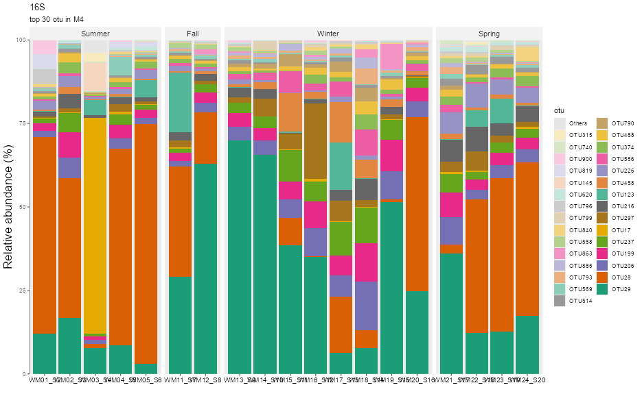

Tomorrow steps: - Start to look at the most dominant taxa and see what pathways they hold - Look back at the 4 modules to see what is going on there - Do a write up of my NMDS plot

# May 19, 2026

Looking at the ANCOMBC2 to investigate which taxa are responsible for changes. I'm not really sure what to do with this information. Maybe I guess I can just start taking a look at the pathways manually? That seems kind of boring tbh.

# May 20, 2026

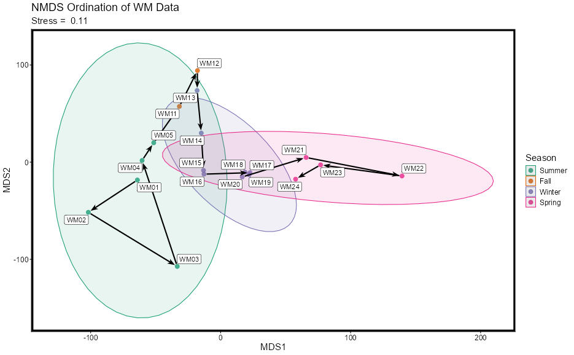

NMDS ordination from Robust Aitchison distances shows distinct succession from WM01 - WM24, with spring and late summer samples showing the greatest differences. Stressplot shown at 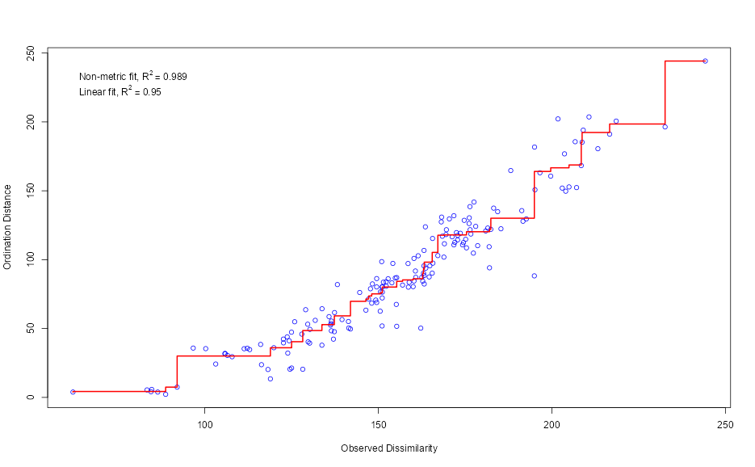

Just to go over it once again I ran NMDS and PCoA for both the MAGs and the 16S data with the different distance measures (Bray, Aitchison, RAitchison, Unifrac (mags only)). Some look better than others but most show a similar sucession. All the plots are in "ouput/plots/beta_div". The ones that look best are: **mag-bray-nmds:** this one shows more like 3 distinct seasons which is interesting. 

For the 16s data the first two axes of the PCoA describe about 40-45% of the data and show almost two separate groups that divide at about WM16.  Comparing this to temperature it looks like this change happens mid-march after a big storm event. 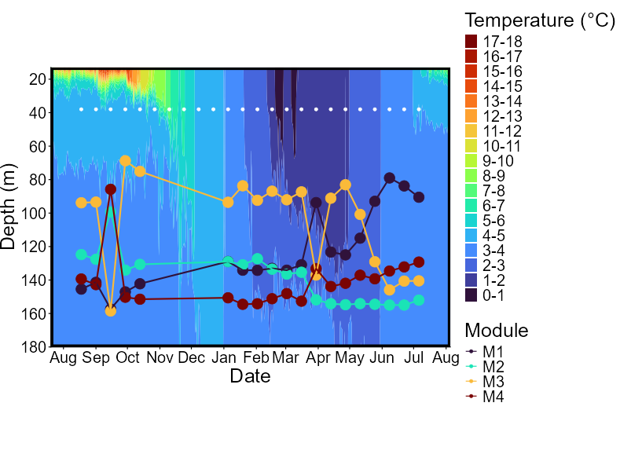

Maybe it is possible that there was some winter growth that didn't catch up until then? It doesn't seem like conditions are all that different between WM15 and WM16.

With the MAG data the PCoA two axes describe about 54% of the the data. It looks more like there are three groupings here in both the bray and the aitchison data. 

The weighted unifrac seems to have the most variation explained by the axes but doesn't have any grouping that makes sense. I am wondering if I input the tree correctly for that one? I should give the tree another shot and then recalculate.

Hmm okay looking at script 02 it looks like I did use the backbone tree for the unifrac distances. It looks I can **combine trees and manually calcuate unifrac distances** but I think that might be a long rabbit hole to go down right now. I am going to try and work with the environmental data instead to see if I can workout what is up with the PCoA groupings.

Next worked on getting the env data figured out and ran a dbRDA. **Need to do more work to make sure I'm doing things correctly** and **check the interpolated values** but it looks like there is some neat clustering going on. Something to look more into. 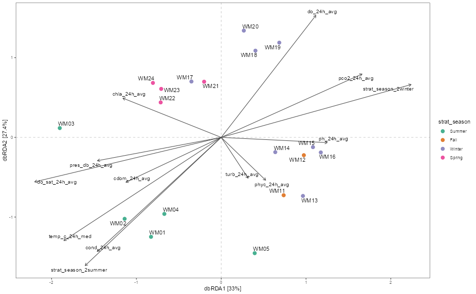

# May 21, 2026

Starting today looking at the environmental data and seeing which were significant, what I could use for a rDBA analysis. (*05_environmental_data.qmd*) Looking at a bunch of different stratification regimes it seems like do_sat, temp, and cond are the big ones with pco2 and cdom significant factors when splitting up by solar season and/or combining winter/fall into the same season. Hmm now that I'm thinking about it, **I should set up a stratification that is just (stratified, overturn, weak stratification)**pc

- Working on wilcox ranking of the environmental data. It looks like chla is a big predictor along with temp, do and pco2. That's pretty cool to see and indicaates that particle associated taxa might be especially important. 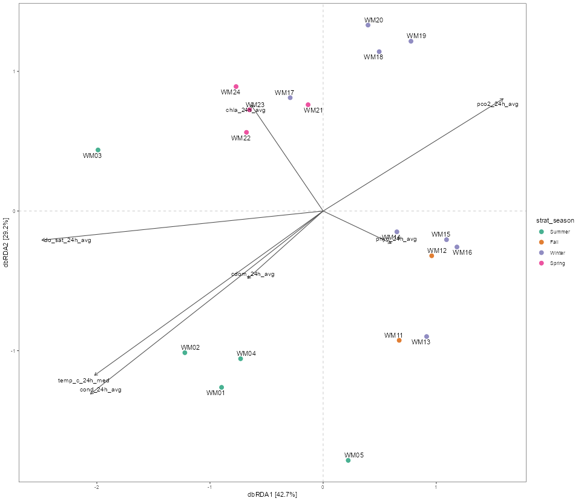

Okay, I made an RDA plot and it looks like there are a couple of families that are strongly associated with chla which is interesting. Chitinophages are a bit driver on one of the axes and the UBA taxa tend to be really common.

In the 16S data the RDA looks kinda wild but it also shows that chitinophages are the major players in the microbial world here.

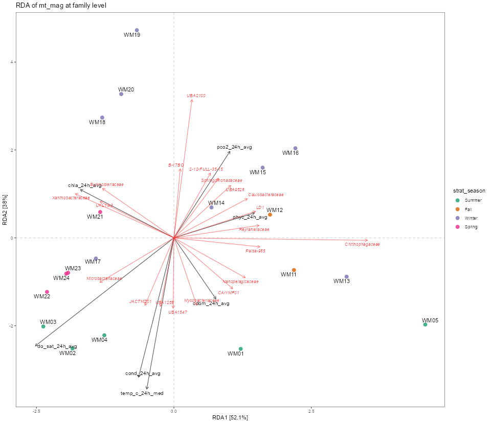 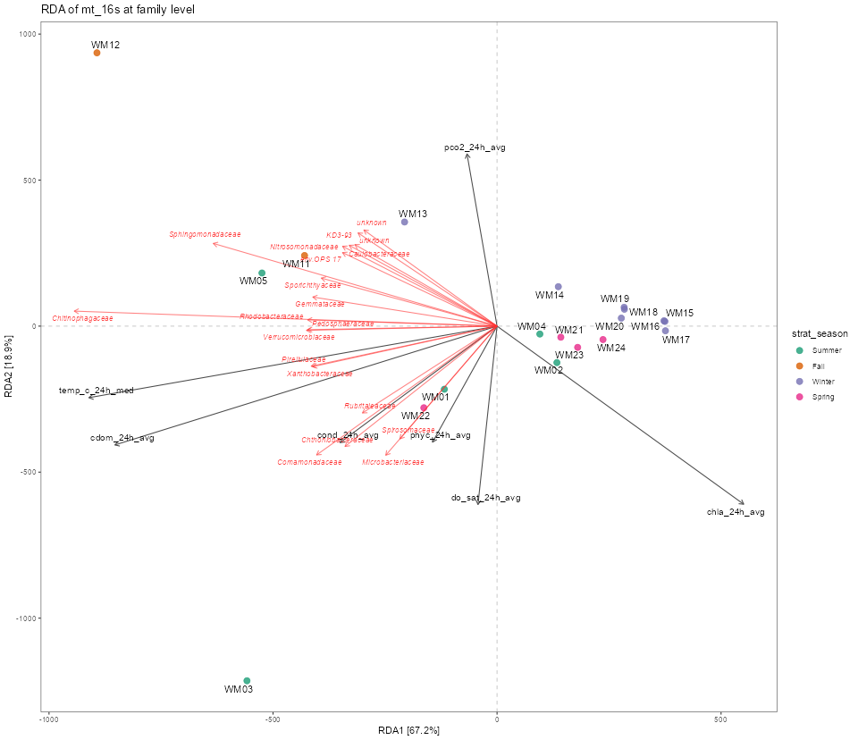

**Maybe it is time to start looking at the chitinophages genomes**

Ended the day trying to get the genes in as a microtable object. I think I need to try and treat each gene like an OTU and then take the abundances off of the bins to see how gene abundance changes. Honestly but also once

# May 22, 2026

Starting to look at chitinophage genomes

Genome

tax information

System

Notes

WM15_S10_008

sediminibacterium

Nitrogen cycle

Looks like this one can do denitrification which is pretty cool. Thinking about how with all the nitrogen in the lake there is more nitrate to use up and so this would be useful. It also interestingly seems to be not super prevalent at the beginning and then gets more and more as the samples progress. I a little bit think that this could be because the bacterium were just left in the filters for that long and were changing that slowly.

- Finally got the gene abundances figured out I think. I ran and saved an ancombc2 and probably should do the same with lefse and a couple other DAs. That would be a good starting point for next week.

# May 26, 2026

Back at it on a Tuesday. First things looking at the ancombc2 significant results. It looks like in fall the sulfur gene comD which is responsible for Sulfolacetate degredation. This occurs in methane metabolism which is interesting. If it is down regluated in the fall that would mean that there is possibly less methane metabolism happening in the fall because of overturn and oxygenation? That would make sense.

I went through and looked at the gene cliques and honestly they weren't that interesting. I'm a little disappointed. Maybe something will show up if I look more specifically at CAZy genes or such. I also wrote some code to put the maestro data on the bottom of the genes. 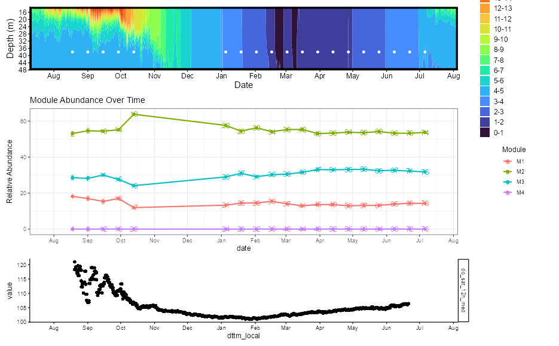

Though another interpretation of this would be that although there are changes in community composition, the functional composition remains similar. It would then be interesting to think about how the growth rates and adaptability of the organisms changes in the different conditions.

I'm also going to try and rerun it to see how things change with 5 modules, but I will try that once I am done with other stuff because it takes a while to run properly.

Another interesting finding is that the big change at WM03 comes with a big spike in CDOM. Possibly because of a DCM showing up? That would point to more particle associated folks hanging out there.

# May 27, 2026

On my list for today: \[ \] Run aldex2 on 16s and decrease the number of taxa

\[x\] Rerun through the modules and see what is up

\[x\] Look at what genes dominate each clique

\[ \] update environmental data to fill in what is interpolated and what is not

Reran the modules and came out with 14 of them! But mostly just 4 that have actual numbers of foam genes in them.

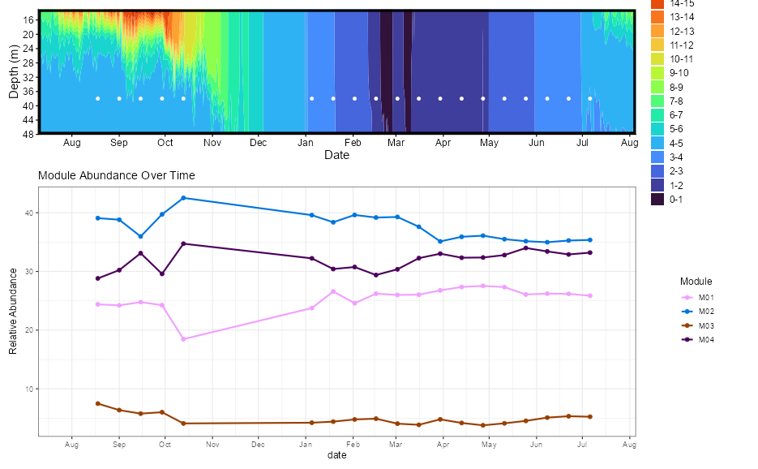

The gene cliques are not that interesting except for a couple of little bumps at WM03 in M4 and M2, WM12 there is a small bump. M1 seems to be inverse of M04 and M02 but they all are the same rank abundance.

Looking at the top 10 categories in level 1 of the foam genes: - Amino acid utilization biosynthesis metabolism is the most abundant group over all which makes sense. Microbes gotta make DNA - The top 8/ 10 are all about the same but in different orders - M2 has a 04_Utilization of sugar, conversion of pentose to EMP pathway intermediates" which shows up in the 10th spot, but is pretty abundant - M1 has a 20_hydrolysis of polymers group in addition to a larger CAZy abundance than the others. This suggests there might be more large polymers to cut up in M1? - M4 also had the 20_hydrolysis of polymers difference that seems interesting...

Okay, now looking at the nested plots:

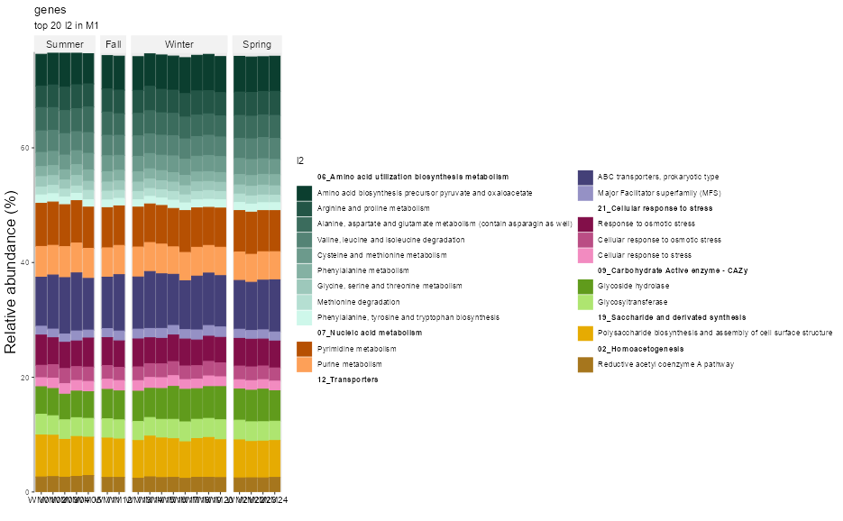 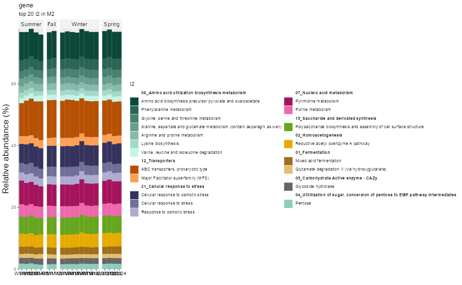 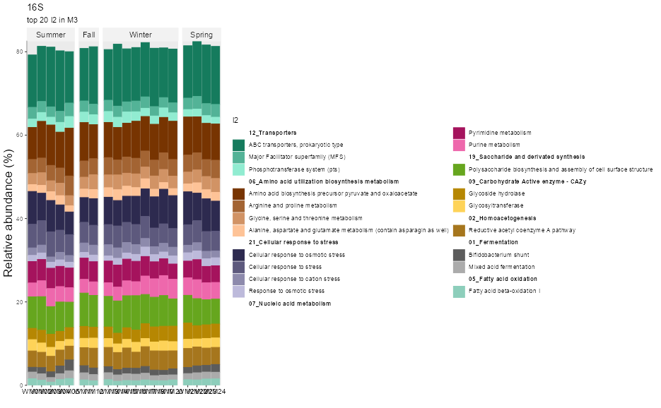 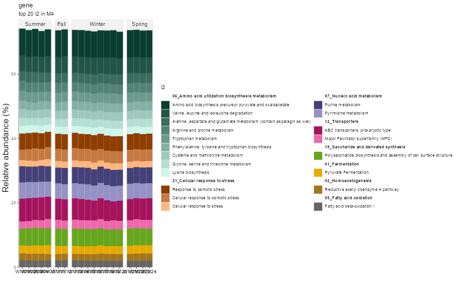

Reminder that abundance of modules is M2\>M4\>M1\>\>M3

M3 has a phosphotransferase system (pts) which none of the others have in 12_transporters. M3 also has less diversity of 06_amino acid utilization biosythesis metabolism M3 has response to cation stress within 21_cellular response to stress M1 has a lot of CAZy, M2 less, M3 a bit more, none in M4 Fermentation is different for each. M1 has no fermentation in it's top 20 M2 - mixed acid ferment and glutamate degredation M3 - bifidobacterium shunt, mixed acid M4 - Pyruvate fermentation (anaerobic)

Bifidobacterium shunt is responsible for producing more ATP than typical carbohdrate fermentation. Found in high fiber conditions?

**is fermentation alway anaerobic?**

\[ \] Next thing to do is create a new Microtable object with the same tax table and the otu table being just module abundance and see what LefSE has to say.

# June 01,2026

I set up a script (12_gene_samples_abundace.R) that will do all the differential analysis on the genes BUT I can't seem to get any information from WM22 and WM23 from metacerberus. My current next step is to try and troubleshoot to see what is going on. Tried running –super tag instead of –prodigal tag in my metacerberus script. Next I might try to run metacerberus on the already existing faa files

Added a little thing to see what the interpolated values for the environmental data look like. I should ask Cody about whether the interpolation is valid. it looks like the issues are:

- Conductivity

- Chla

- DO

I could go back and interpolate earlier or just remove the data from those that don't have data OR I could probably input some CTD data.

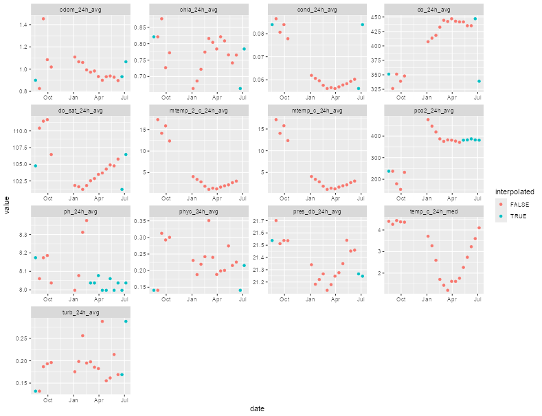

Now moving forward to look at the data that Tim sent.

Superior-PPS recover 2024-2025.txt file:

It looks like it might have only sampled 17 times? the last sample recorded was on 3/30/2025, which corresponds with WM17. TThe machine flushed but it didn't record that a sample was pumped in. So potentially up to 16 is all the data that we have. There was a data stop line on March 30, 2025. It does look like in other years the sampler did record all 30 samples. Some years it didn't.

There was also a fixative applied which would be an interesting thing to record and probably necessary for a methods section.

After meeting with Cody I should start to look at heterotrophs vs autotrophs and start to look for cool types of metabolisms particularly carbon.

Looking at the various pathways:

01_fermentationwould be an interesting one to look at but not all that much difference through the year.

05_fatty acid oxidation, fatty acid beta oxidation jumps at the weird ones at S3 and S12

02_homoacetogenesis is an anaerobic pathway

08_hydrocarbon degredation is interesting

09_CAZy doesn't really seem to change that much

10_TCA cycle is interesting especially the reductive TCA cycle changes throughout the winter

11_nitrification goes up and down a lot

12\_ hydrogren metabolism is also interesting it has more of a seasonal cycle which could be due to cyanos and such

18)\_sulfur there is a late summer bump in chemoautotrophic sulfur compound folks (**who is that?**)

Ones to remove:

07 nucleic acid metabolism

06 amino acid utilization biosynthesis metabolism

21 cellular response to stress

19

# June 2, 2026

**Do I need to redo any of the mapping and such becuase of the last few samples not being quality samples?**

# June 3, 2026

Installed WSL, installed hmmer, unzipped the microtrait.hmmdb file, then ran hmmpress on it. Then manually put the data into microtrait/extdata/hmm/hmmpress

I am still missing the DBCAN data but I can maybe download it separately from the DBCAN github. For now am just ignoring it and seeing if microtrait will work.

I ran into an issue installing prodigal on the windows side of my computer so I am going back through and running R through my ubuntu side. Right now am installing devtools so I can go and install the other packages (gRodon and microtrait). Then I'll see if I can run microtrait.

Also created a master spreadsheet of all my samples that I have now. Tomorrow I should try to exctract some of them.

# June 4, 2026

STILL working on getting microtrait and grodon to run. Now I am fighting with positron to try and run them on the msi servers.

I have a setup script but other things I need to do before running things in R: - Setup a new conda environment to download packages and R into - download R into that environment - Install devtools into that environment (through conda) - tell positron to look for R in the conda environment - tell positron not to abort kernels once they are inactive so I don't have to keep logging back on - Then can start installing packages, it will take a while. - But then you can do an Rscript myscript.R to run anything you want. Woo!

Finished the microtrait stuff and saved a local copy of my output under "genomeset_results.rds"

\# June 8, 2026

Working on filtering out pollution in my samples. That will entail filtering out all the taxa found in samples 17-24 that did not get pumped.

Question: - Do I need to run coverM again? probably I think.

```         
For the 16S contamination: I should filter out the taxa from the Synmock community that are super prevalent in the other samples. Maybe I can add another row that is relative abundance of the other samples. 

Possible contamination OTUs from synmock:
OTU160
OTU412
OTU417
OTU891
OTU400
OTU589
OTU660
OTU355 - possibly not though
OTU230
OTU385
OTU421
OTU93
OTU71
```

# Jun 09, 2026

Goals for today in R: \[x\] Finish going through Cody's paper and pull out the list of contaminants. \[x\] Try running microclean and see where that gets me \[x\] Check out other R packages for contamination

Also would like to do a bit of research to see if I am okay to do the bead beating, freeze and then extract at a later date.

After talking with Emma it seems like I should just do them all in one go. I am going to maybe try 6 this next time and see how that goes. Need to look for control types

Worked through a bit of micRoclean and it filtered out 94% of the usual data -- oops. I might have had too many blanks. Tomorrow I should take a look at just doing one blank and seeing how things work.

# June 10, 2026

Today want to go through and see what 16S model to use. I ended up running cliques and taking only the taxa that were in 3 or more of the filtered samples. M1 - sediminibacterium seems to be a big one. BUT it is also possibly a contaminent. I should double check and see if it is possible that it a real sample.

M2 - LD29 in verruca seems to be really prevalent. Can't find much information on it. Again some more sediminibacterium. One of them is around in 8/9 samples though so that is good.

M3 - g\_\_Bacteroidetes bacterium UKL13-3 could possibly be cyanobacterial associated. Seems to be with M3 becoming more common in the winter.

# June 12, 2026

So far have done WM01-WM15 for superior 2021-2022. Will continue to work on those next week. Looking at contaminents in the data:

For the contaminents based on whether that taxa was filtered out by micRoclean in the 16s data, it seems like there isn't much of a trend. I might have to be more careful of these samples and it does look about 50/50.


However, looking at the list of contaminents based on whether they were found in the blank sammples or not, it looks like there is a pretty distinct community of dudes found more so in the blanks than in others. That leads me to believe that I can filter those out and may have some actual trends to look at.

I will try to remove those taxa and move forward. **START HERE NEXT WEEK** Hmm I should also think about abundance and coverage and whether I need to stick with my original coverM run or not.

# June 17, 2026

Met with Cody. Reran micRoclean without the synmock community and it all seemed to be about the same. Moving forward with probably calling all the other blanks to be conservative.

Todo tomorrow:

- Make a clean script for the 16S data with cleaning contamination and explaining what I'm doing

- Clean up the MAGs data

- Rerun microtrait and go from there

# June 18, 2026

From yesterday:

- [x] Make a clean script for the 16S data with cleaning contamination and explaining what I'm doing

- [x] Clean up the MAGs data to match what I have in the 16S data

- [ ] Rerun coverM on just the mags I am interested in

- [ ] Rerun microtrait and go from there

# June 19, 2026

Continuing to work on my list above. I finally finished cleaning both the MAGs and the 16S data. I am now going to re run the coverM and and also microtrait.

# June 24, 2026

Writeup of how I filtered contamination:

From 16S taxa:

1\) Filtered out any taxa associated with the Synthetic Mock community

2\) Ran micRoclean package with associated well numbers (found from initial sample submission sheet). I used their "pipeline 1" to search for the original composition of the samples. I treated samples WM17-WM24 (s_2425) as blanks because they did not pump. This was the most conservative option.

3\) Narrowed down taxa to just those that remained abundant in the samples

4\) Look through each of the taxa from "Sheik et al, 2018." For each taxa I looked to see if it could reasonably be found in pelagic Lake Superior. This consisted of a quick google search. I kept taxa were found in freshwater. Reasoning can be found in ("02.1_import_clean_16s_data.R").

For MAGs:

1\) I worked under the assumption that if we had a taxa in the MAGs then it would also be in the 16S dataset.

2\) I imported all 800 bins from all samples

3\) removed all the bins from WM17-WM24

4\) Removed the bins that matched the family and genus of a possible contaminant taxa from the 16S dataset. In this I also had a fuzzy match for names that differed slightly. I combed through those by hand and removed matches

5\) Afterwards was left with \~300 bins for CoverM and dereplication

6\) I filtered just to keep the bins that had abunance calculated. 

Also starting working through the microtrait results. I should continue to look at these tomorrow. For now, I have two good microtables and some data to move forward with. 

**NEXT PLACE TO START:**
  -  Continue script to clean and make sylph data nice
  -  Continue working through microtrait data

  # June 25, 20206

  Did another round of extractions. Only 18 to go! Will only do 6 each time from now on. Hopefully I can prep and send samples on July 6th or 7th. 

  Cleaned up some of my r work and started working through the microtrait stuff. I think I need to take some longer time to go through that and set up functions to look at all the different options. link is here: https://github.com/ukaraoz/microtrait

# July 01, 2026

Made it to july! 

TODO:
[x] Split the MAGs into heterotrophs and autotrophs
[ ] Look for nitrogen genes
[ ] Look for phosphorous genes
[x] Look for CAZy genes for possible particle associated-ness
cazy genes/carbon breakdown can be found using [16] "g1_Resource Acquisition:Substrate degradation:complex carbohydrate depolymerization" and
[17] "g1_Resource Acquisition:Substrate degradation:simple compound degradation" 


Question for Cody: Does the normalized trait matter? I think I really am just working on presence/absence. 

Didn't see much of a difference looking at how heterotrophs, phototrophs and chemotrophs changed between summer and winter.
**NEED to deal with samples 02 and 04 possibly being contaminated.**


# July 06, 2026

Back from a weekend break. Looking at the split between heterotrophs chemotrophs and autotrophs. 

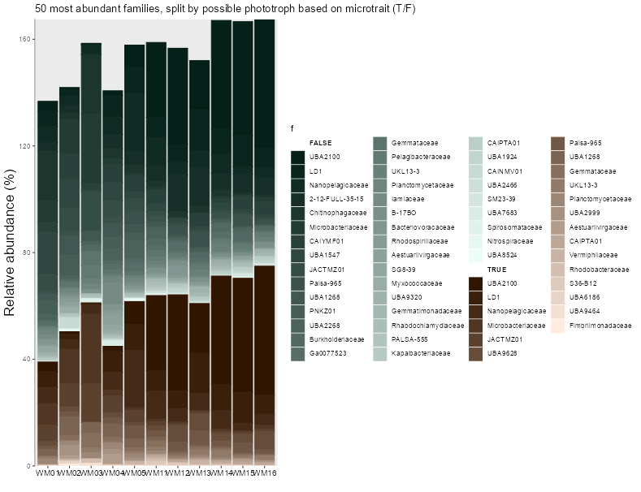

Looks like the phototrophs get relatively less abundant in the later season. That could make sense with less light in general

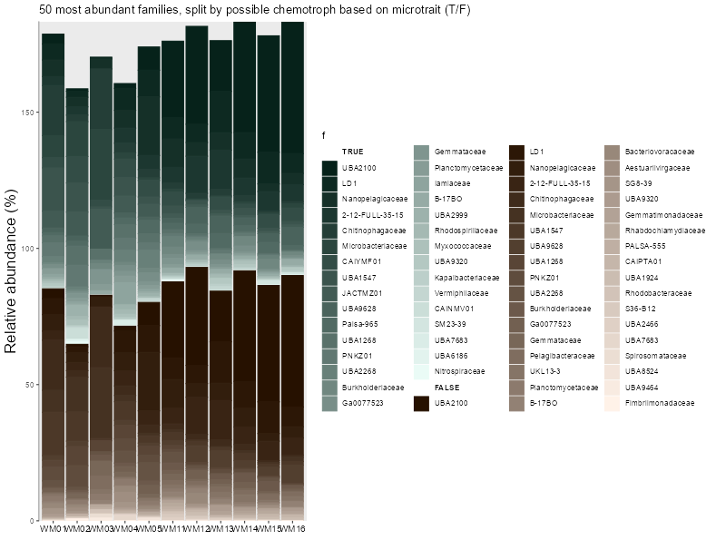

Chemotrophs don't show much difference I have to say

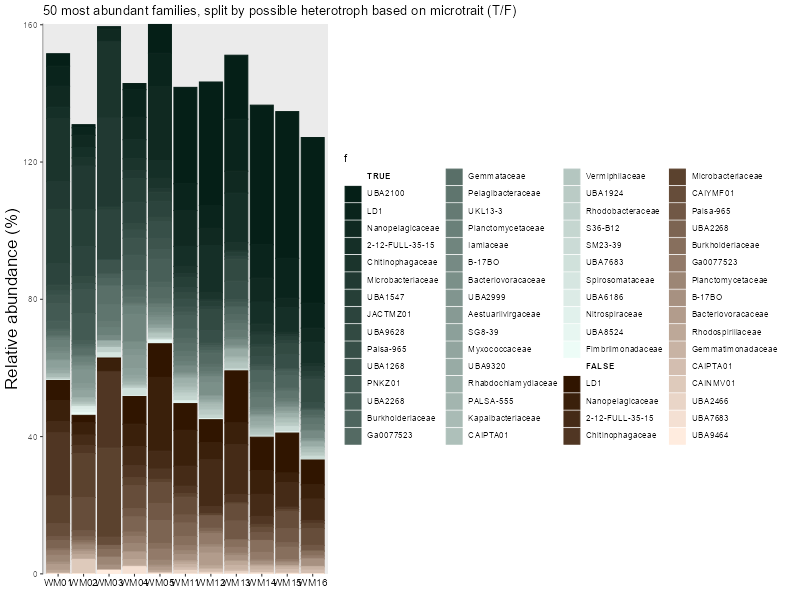

It does look like there are more heterotrophs moving towards the later months. That would make sense to me. 

**Look at how heterotrophs and phototrophs change abundances throughout the year**

Looking at complex carbohydrate depolymerization it seems like all of them are true which is not super helpful. 

**Tomorrow:**
  - Keep looking at nitrogen genes
  - Find a new way to differentiate CAzy genes
  - See if I can remove the columns that are all TRUE from the tax table. 

  

  
  