# July 21, 2026

New notes doc to help with that other one starting to be a bit unwieldy

### UBA information

The winter and non abundant genomes have the petE gene or plastocyanin gene which is part of an electron transport chain in photosynthetic organisms. However, there is not the same in the two summer UBA bins.

Winter \> WM15_035, WM14_032

Summer \> WM12_038, WM14_031

Smol \> WM12_050

That's about all I can find for photosystems

### Chitinophagales

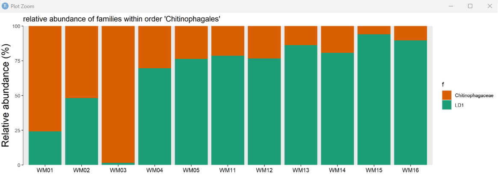

Looks like there is a steady increase in the LD1 family. The Chitinogphagaceae family is mostly abundant at the beginning and at WM03.

- [ ] Look at WM03 to see if there is a difference in the environmental data there.

Looking at just the bins within chitinophagales, it looks like there are three distinct groupings.

WM01-03 has a pretty equal distribution of Bins WM11_008, WM01_002, WM12_002, WM02_003

WM04 - WM05, WM11-12 is dominated byWM12_003 and WM04_004 with some other other 4. WM13-WM16 is mostly just WM12_003 and WM04_004 with very little of the others.

#### Bog - 950

One of the major bins (WM04_004) has a complete pathway for assimilatory sulfate reduction ending at sulfide, but no genes for dissimilatory sulfate reduction.

Also a nearly complete calvin cycle but missing rbcS

Nitrogen: has genes for ammonia to glutamate

Photosystems, it has the cytochrome f complex with transfers electrons from photosystem I to photosystem II but it doesn't have anything to respond to photons. Maybe that is a more common thing?

It has a nearly complete Wood-Ljungdahl pathway

Genes for folate biosynthesis (nearly complete)

There are genes for phospholipid transport which I guess makes sense.

Weirdly there are a number of genes for terpenoids biosynthesis which

Notes:

```{r}
library(tidyverse)
load("output/data/mt_mag.RData")

mt_mag$sample_table |> 
  select(sample, date, contains("24h")) |>
  mutate(is_WM03 = sample == "WM03") |> 
  pivot_longer(cols = -c(sample, date, is_WM03), names_to = "var", values_to = "val") |> 
  ggplot(aes(date, val, group = var, color = is_WM03)) +
  geom_point() +
  geom_line() +
  facet_wrap(~var, scales = "free") +
  theme_classic()
```

From this plot we can see that CDOM is pretty high during WM03. Was there a storm on that date?

# July 26, 2026

Continuing to look at contaminants from the sheik list. I think that I should probably remove Bacillus cerus from the list. It is so so abundant across all samples which makes me think it is a contaminant.

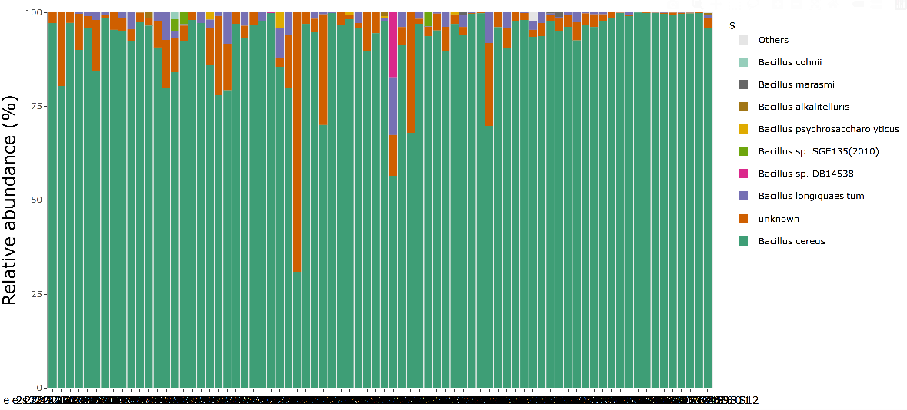

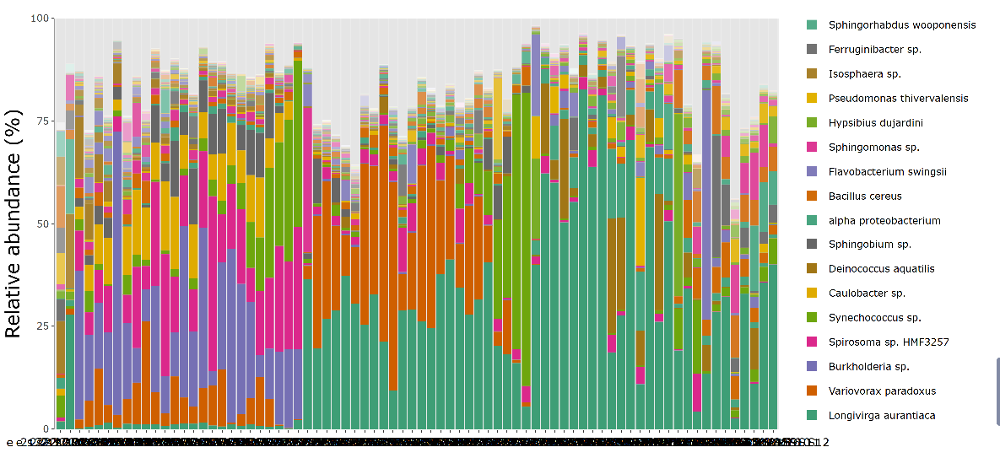

# July 27, 2026

Kept working through the contaminants. Added the list from Einsenhofer and figured out a more efficient workflow.

# July 29, 2026

- [ ] Look at OTU4 and OTU82 from sediminibacterium to see what they are similar to. For now I will keep them in.

# July 30, 2026

Made an nmds plot of the 16S data but there is pretty clear clumping of the sample years being more similar than the season. That makes me think there might be more contamination than I thought

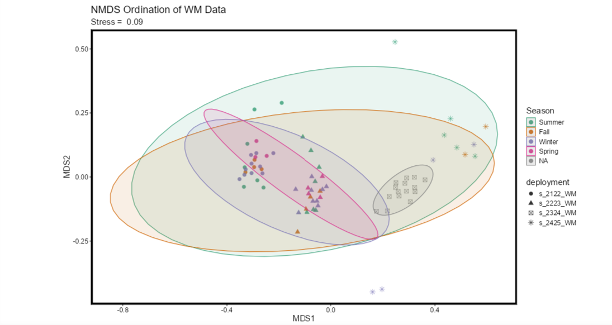

That's kinda a bummer.

# July 31, 2026

Learning from yesterday I think I should try and see if there are any differences that I can pull out of the beta diversity. I could also try to run an ancombc2 on the reads or check out the trans_func to see if there is functional diversity. I also think I might try and add in the taxa that I didn't take out by hand and see what happens there.

Okay, plan for today–

- [x] NMDS on full 16s and 16s without my hand removal

- [x] NMDS/MANOVA looking at a variety of variables

- [x] Setup/run an aldex2/ancombc2 on the 16s data (Start here)

- [x] try the trans_func stuff to see what I find

- [ ] Try to take a look at OTU4 and 80? to see what is up with them

- [x] Look at just raw abundances across seasons

Some interesting patterns but nothing crazy.

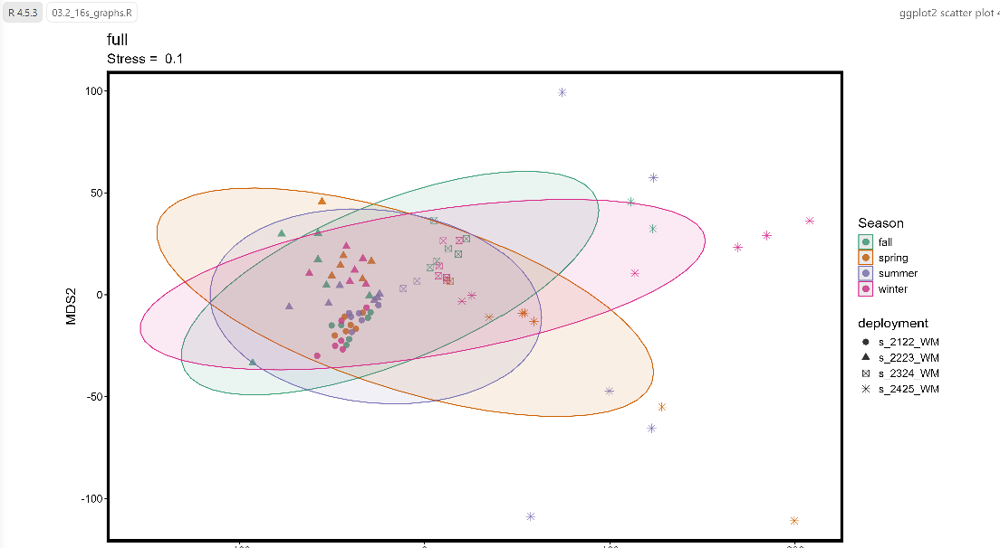

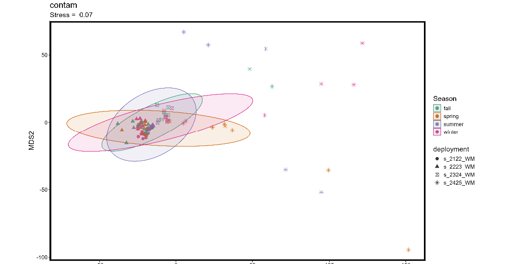

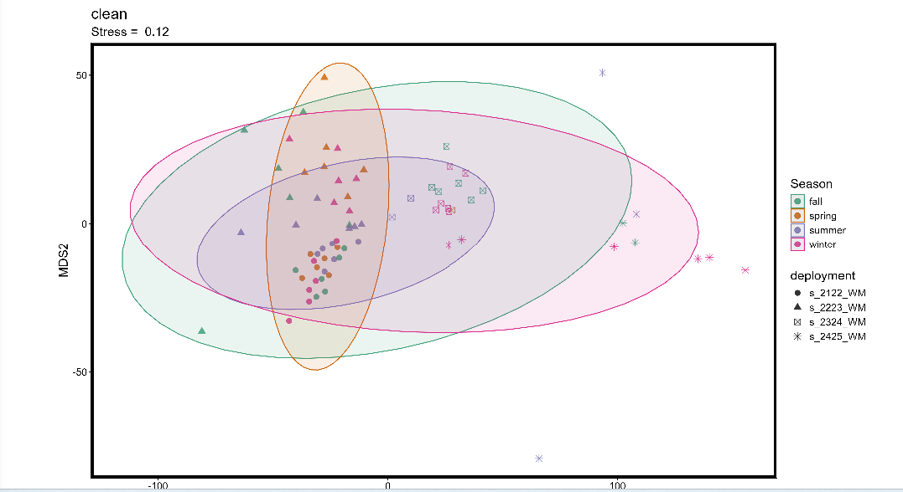

Looking at the nmds for the full16s data, the clean and just the contaminants it seems like there are not huge shifts between either bit there is the most clustering by deployment rather than by season at all. Maybe I can color by pressure and depth or temp will have something to do with it?

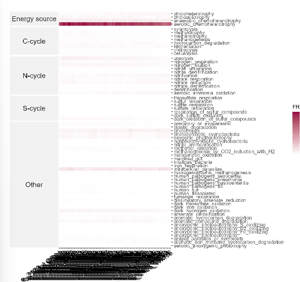

After calcuating functional redundancy (03.4) it looks like most of what I have is aerobic chemoheterotrophy and there is some intracellular parasites . Other wise I don't see a lot of difference.

I should try the tax4fun stuff but for now I want to move on to something else.

From the ancombc2 and aldex2_kw I should keep an eye on:

OTU204

OTU946

OTU1191

OTU658

OTU881

OTU837

OTU1044

This plot of how the significant taxa changes (03.3) seems have some indication that the green OTU204 is more common in the winter and summer than in the spring.

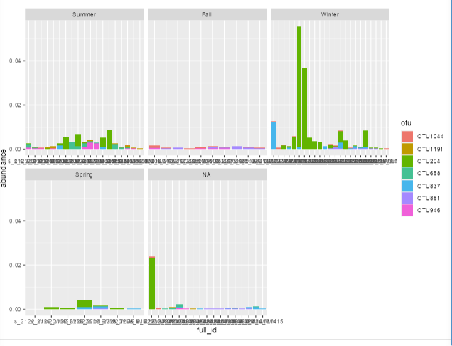

That one is the flavobacterium of unknown species. Cyanobium is also different across all seasons as well as a planctomycete thing. I can also see that the longivirga aurentica is one of the most common.

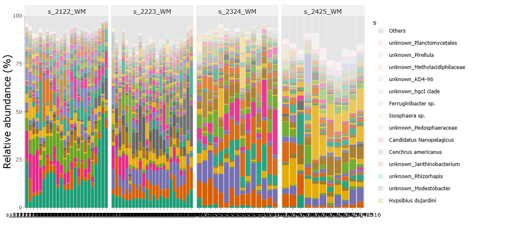 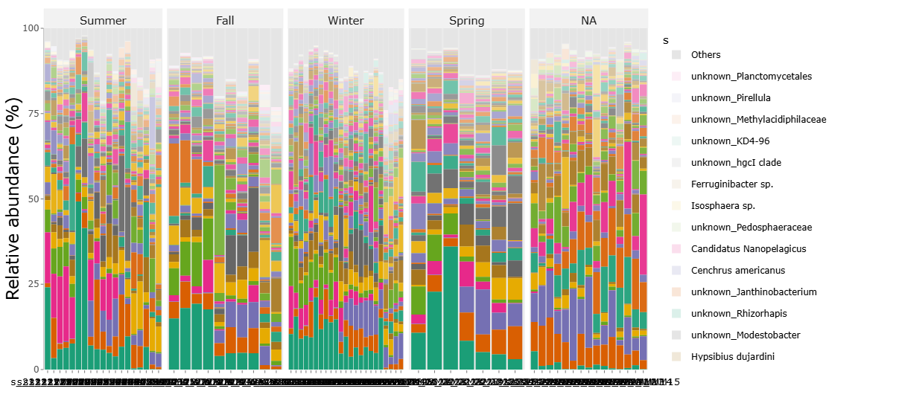

It's abundance doesn't really change much by season I would say.

```{r}
load("output/data/mt_16s.RData")

s_mt <- clone(mt_16s)

s_mt$sample_table <- s_mt$sample_table |> 
  filter(lake == "superior")
a <- trans_abund$new(s_mt, taxrank = "g", ntaxa = 50)$plot_bar(facet = "strat_season") |> 
  plotly::plotly_build()

a
a <- trans_abund$new(s_mt, taxrank ="s", ntaxa = 100)$plot_bar(facet = "strat_season") 
plotly::plotly_build()

a

a <- trans_abund$new(s_mt, taxrank ="s", ntaxa = 100)$plot_bar(facet = "deployment") |> 
  plotly::plotly_build()


```

Next I want to look at the cliques. Start there next time. I think the 16S data doesn't tell much of a story but we well see.

# August 03, 2026

## 16S Data Summary

- The NMDS shows clumping by deployment but not by season

- Top interesting taxa are:

  - Longivirga Aurantica

    - Lake sediment bacteria (actinomycete)

  - Cyanobium–They are most abundant during the spring and summer

  - 

  - OTU204 flavobacterium

    

I'm seeing a spike in module 67 (purple) during the summer months. That one is primarily synechococcus so that's interesting to see. I wonder if we have a genome for that?

M1 and M2 run in opposition to each other, I wonder why that is?

As per Cody's suggestion I tried a bunch of rarefying and normalizing and they all came out about the same. The function is in "scratch.R" if needed in the future.

```{r}
load("output/data/mt_16s.RData")

s_mt <- clone(mt_16s)

for(i in 1:12){
  s_mt <- clone(mt_16s)
  s_mt$sample_table <- s_mt$sample_table |> 
  filter(lake == "superior") |> 
  mutate(month = month(date)) |> 
    filter(month == i)
  s_mt$tidy_dataset()

  a <- trans_abund$new(s_mt, taxrank = "g", ntaxa = 50)$plot_bar(facet = "deployment") +
  ggtitle(paste0("Month:", i))
  print(a)
}
```

This shows comparisons month to month, it all seems pretty similar to me...

Taken from gemini :(

|  |  |  |  |  |
|---------------|---------------|---------------|---------------|---------------|
| **Research Goal** | **group** | **within_group** | **by_group** | **What it Measures** |
| **Seasonal Turnover** | `"season"` | `FALSE` | `"deployment"` | Turnover between seasons, paired strictly within each deployment year. |
| **Deployment Shifts** | `"deployment"` | `FALSE` | `"season"` | Turnover between deployment years, paired strictly within the same season. |
| **Within-Season Dispersion** | `"season"` | `TRUE` | `"deployment"` | Dissimilarity among bi-weekly samples within each individual season-deployment pair. |

Stopped at beta turnover in mecoturn. Look at Cody's email for more. Hopefully I can start here with the "b" object and see what has come of that.

# August 05, 2026

Working on beta dispersal. I have some notes on what I was thinking about in one of the stegen papers in zotero under stats. I think I need a break from it now. What I am trying to do is seeing if I can quantify much turnover there is with each sample.

Next steps:

- [ ] Beta dispersion

- [ ] upset plots

# August 07, 2026

I'm seeing here there is a trend that the closer in time two samples are, the more likely it is that environmental selection is responsible for the differences between the samples. Which makes sense, there is less time for the samples to change.

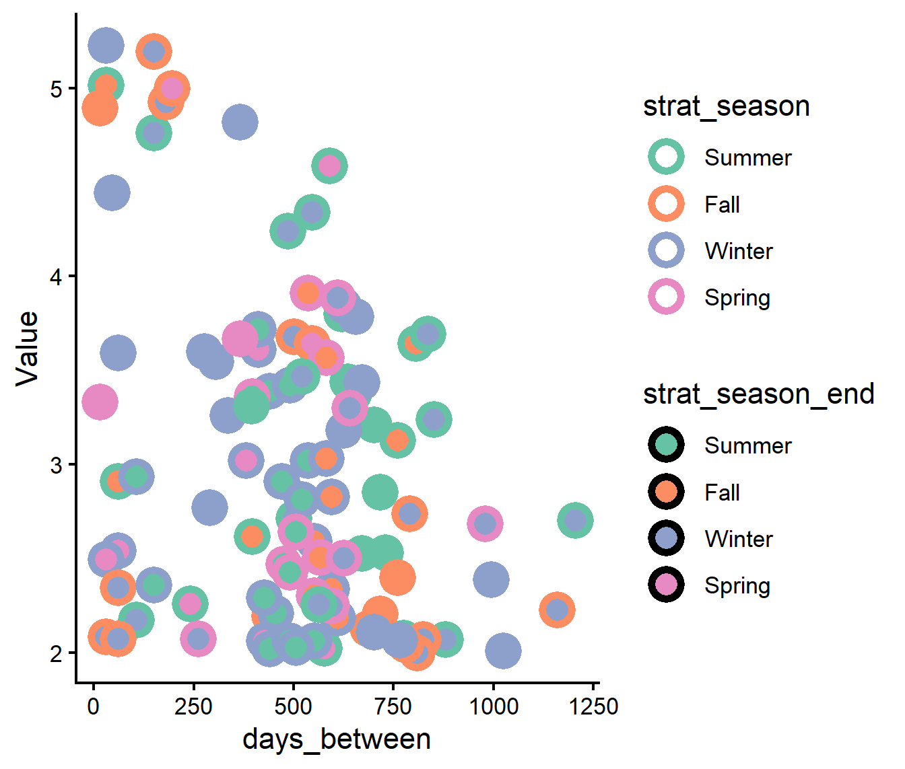

I next want to look at temperature and mixing and if that has an affect. Start next time by calculating days since stratification and see if that tells us anything.
